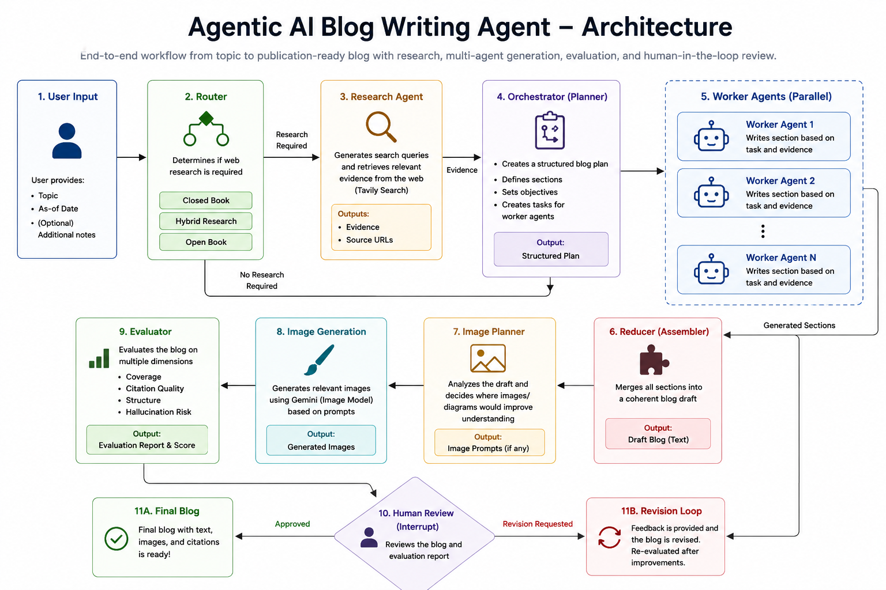
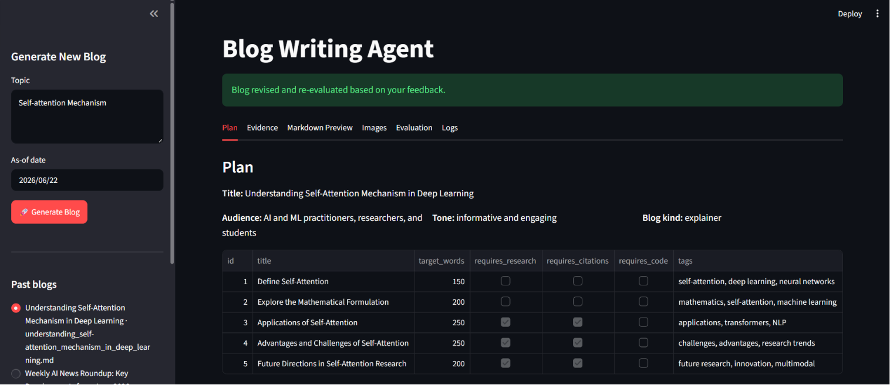
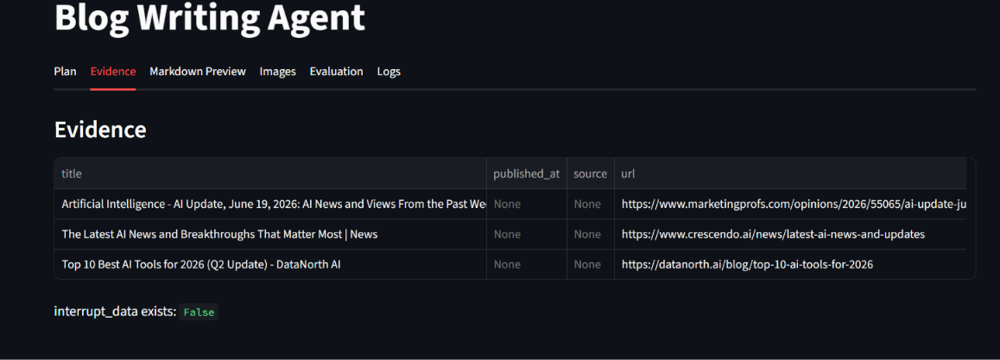
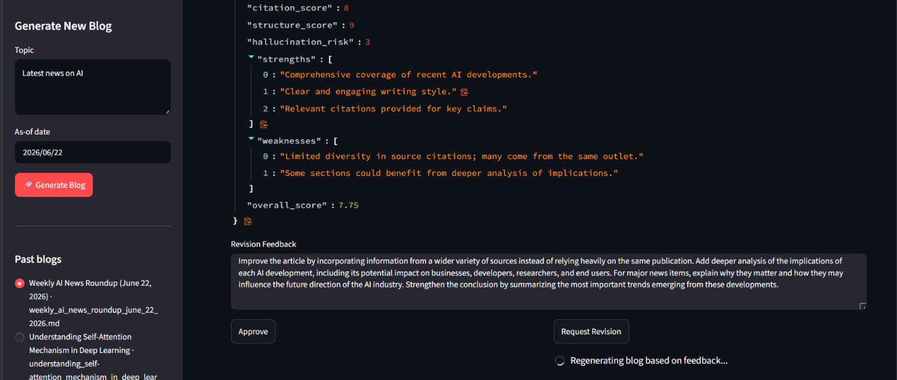
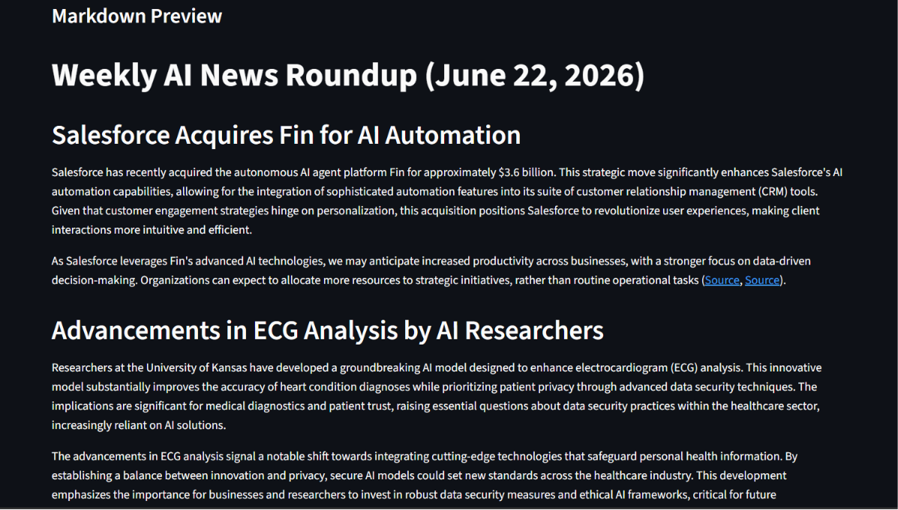

# Agentic AI Blog Writer

An end-to-end autonomous content generation system built using LangGraph, LangChain, OpenAI, Gemini, Tavily, and Streamlit.

This project goes beyond traditional prompt-based content generation by implementing a planning-based multi-agent architecture capable of researching, planning, generating, evaluating, and revising content before producing a final publication-ready blog.

The system automatically determines when internet research is required, performs evidence gathering, distributes work across multiple agents, generates supporting visual content, evaluates output quality, and incorporates human feedback through a review loop.

## Live Demo

Deployed on Render: https://blog-writing-agent-xo4y.onrender.com/

## Problem Statement

Most AI blog generators rely on a single prompt and generate content without planning, verification, or quality control. This often leads to factual inaccuracies, poor structure, lack of citations, and limited adaptability for complex topics.

This project addresses those challenges by implementing an orchestrated agent workflow that performs research, planning, content generation, evaluation, and human review before producing the final result.

## Key Features

### Intelligent Research Routing

The system first determines whether external research is required before planning the blog.

Supported modes:

* Closed Book
* Hybrid Research
* Open Book Research

For time-sensitive topics, the system automatically generates research queries and gathers evidence from the web.

### Multi-Agent Orchestration

The workflow follows an orchestrator-worker architecture.

The orchestrator:

* Creates a structured blog plan
* Defines content objectives
* Breaks the blog into smaller tasks

Worker agents:

* Generate individual sections in parallel
* Follow task-specific instructions
* Incorporate citations when required

### Research-Powered Content Generation

The system integrates Tavily Search to:

* Collect relevant sources
* Extract evidence
* Support factual claims
* Generate citation-backed content

### Automatic Image Planning and Generation

The reducer analyzes generated content and determines whether visual aids would improve understanding.

If required:

* Image prompts are generated automatically
* Images are created using Gemini
* Images are inserted directly into the final markdown document

### Evaluation Framework

Every generated blog is evaluated using an LLM-based evaluation layer.

Evaluation dimensions include:

* Topic Coverage
* Citation Quality
* Structure and Readability
* Hallucination Risk

### Human-in-the-Loop Review

If generated content does not meet the quality threshold:

* Human review is triggered
* Feedback can be provided
* The blog is revised automatically
* Re-evaluation occurs before approval

This creates a production-style content review workflow instead of a one-shot generation process.

## System Architecture

Insert architecture diagram here.

The workflow follows:

User Topic

↓

Router

↓

Research Decision

↓

Research Agent (Optional)

↓

Orchestrator

↓

Parallel Worker Agents

↓

Reducer

↓

Image Planning

↓

Image Generation

↓

Evaluator

↓

Human Review

↓

Approval or Revision

↓

Final Blog

## Technology Stack

### Agent Framework

* LangGraph
* LangChain

### Language Models

* GPT-4o-mini
* Gemini 2.5 Flash Image

### Research Layer

* Tavily Search

### Frontend

* Streamlit

### Monitoring

* LangSmith

### Deployment

* Render

## Project Structure

```text
Blog-Writing-Agent/
│
├── bwa_backend.py
├── bwa_frontend.py
├── images/
├── screenshots/
├── requirements.txt
├── .env
└── README.md
```

## Screenshots

### Architecture Diagram



### Blog Planning



### Evidence Collection



### Human Review Workflow



### Generated Blog



## Running Locally

Clone the repository:

```bash
git clone https://github.com/your-username/Blog-Writing-Agent.git
cd Blog-Writing-Agent
```

Install dependencies:

```bash
pip install -r requirements.txt
```

Create a `.env` file:

```env
OPENAI_API_KEY=
GOOGLE_API_KEY=
TAVILY_API_KEY=
LANGCHAIN_API_KEY=
```

Run the application:

```bash
streamlit run bwa_frontend.py
```

## Design Decisions

This project intentionally uses an orchestrator-worker architecture rather than a single-agent approach.

Benefits include:

* Better scalability
* Parallel content generation
* Improved maintainability
* Easier integration of evaluation and review loops
* Closer alignment with modern production AI systems

## Future Improvements

* Persistent database storage
* Multi-language blog generation
* PDF and DOCX export
* Citation verification
* Async worker execution
* Long-term memory across sessions
* Multi-modal retrieval

## What This Project Demonstrates

* Agentic AI workflows
* Multi-agent orchestration
* Retrieval-Augmented Generation
* Human-in-the-loop systems
* Evaluation-driven AI applications
* LangGraph state management
* Production-grade AI architecture
* End-to-end deployment

## Author

Harsh Raj

B.Tech Graduate | Data Science Engineer

Interested in Generative AI, Machine Learning, Agentic Systems, and Applied AI Engineering.
